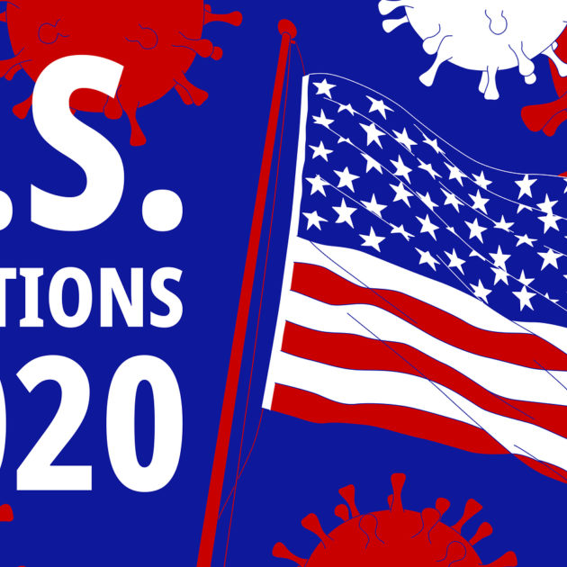

# Applied Data Science 
#Weiwei Song
## Spring 2021
## Project 1: A "data story" on how Americans vote



### [Project Description](doc/)
This is the first and only *individual* (as opposed to *team*) this semester. 

Term: Spring 2021

+ Projec title: IF TRUMP COPE WITH COVID-19 SUCCESSFULLY, WILL HE WIN?
+ This project is conducted by [WEIWEI SONG]

+ Project summary: [a short summary] Back in February of 2020, the world situation is completely different. At that time, the unemployment rate in the United States was the lowest in decades, the stock market repeatedly hit record highs, and the situation of President Trump's re-election was very good. However, the COVID-19 pandemic changed this situation dramatically. Many people say that Trump's response to Coronavirus is one of the main reason he failed in the election. Is that true?
 
Following [suggestions](http://nicercode.github.io/blog/2013-04-05-projects/) by [RICH FITZJOHN](http://nicercode.github.io/about/#Team) (@richfitz). This folder is orgarnized as follows.

```
proj/
├── lib/
├── data/
├── doc/
├── figs/
└── output/
```

Please see each subfolder for a README file.
