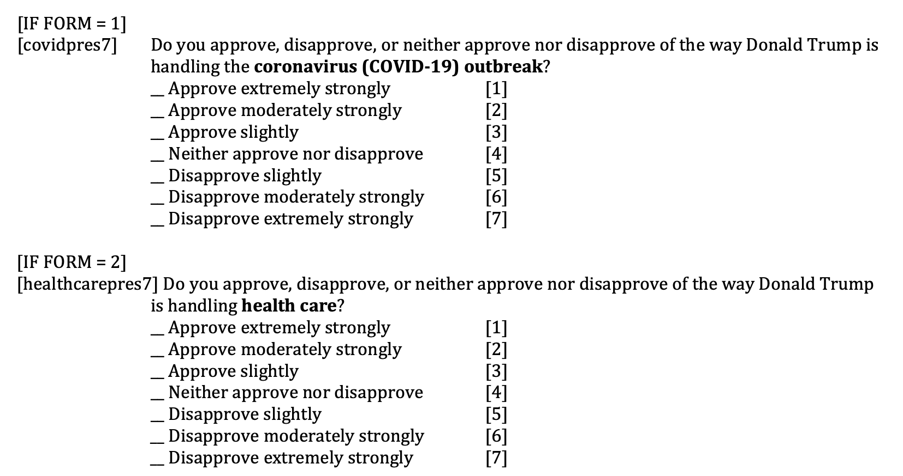

---
title: "IF TIME GOES BACK WITH NO COVID-19,WILL TRUMP WIN?"
author: "Weiwei Song"
date: "1/22/2021"
output:
  html_document:
    df_print: paged
  word_document: default
  pdf_document: default
---


Back in February of 2020, the world situation is completely different. At that time, the
unemployment rate in the United States was the lowest in decades, the stock market repeatedly hit
record highs, and the situation of President Trump's re-election was very good. However, the
COVID-19 pandemic changed this situation dramatically. Many people say that Trump's response to
Coronavirus is one of the main reason he failed in the election. Is that true? This report is based
on the ANES 2020 Exploratory Testing Survey conducted between April 10, 2020 and April 18, 2020. For more information, please visit  https://electionstudies.org/data-center/2020-exploratory-testing-survey/

My analysis is based on the real situation in the April 2020, assume if the presidental election hold at that time, will Trump be the winner? 

```{r include=FALSE}


library(tidyverse)
anes_pilot_2020<-
  read_csv("../data/anes_pilot_2020ets_csv.csv")
#clear all missing data, and rename the variable 
#Make question form=1, if asked about covid; form=2, healthcare
trump_data <- anes_pilot_2020%>%
      select(apppres7:healthcarepres7,covid_inf=covid1,covid_eco=covid2)%>%
      na_if(99)%>%
      na_if(9)%>%
      rename(Job=apppres7,relation=frnpres7,immgration=immpres7,economy=econpres7,covid=covidpres7,healthcare=healthcarepres7)%>%
  na_if(77)%>%
  mutate(Form=if_else(covid==88,2,1))%>%
  na_if(88)%>%
  mutate(Answer=coalesce(covid,healthcare))%>%
  select(-covid,-healthcare)%>%
  drop_na()
number_row<-nrow(trump_data)
write_csv(trump_data, "../output/approval_data.csv") 

```


### Question 1: 

This questionare have two Form in the Trump Job Approval category.

## Question 1: Does the COVID-19 really have a huge impact in the election in April 2020?


Should health care and coronavirus(COVID-19) be merged as one variable? Let's see the distribution of people's answers iterms of this question. 


```{r echo=FALSE}
graph_data<-trump_data%>%
  select(-Form,-covid_inf,-covid_eco)%>%
  gather()%>%
  group_by(value)%>%
  count(key)%>%
  mutate(prop=n/number_row)%>%
  ungroup()
```


```{r echo=FALSE}
data1<-trump_data%>%
  select(Form, Answer)%>%
  group_by(Form)%>%
  count(Answer)%>%
  mutate(total=sum(n),prop=n/total)
ggplot(data1,aes(Answer,prop,fill=factor(Form)))+
  geom_col(position="dodge")+
  theme_classic()+
  labs(title="Distribution of  answers of two form of questions", subtitle="Form=1:COVID-19  Form=2: health care",x="Answer",y="Probability", fill="Form")
```

From the plot, people are more likely to hold an approval attitude towards Trump's job handling COVID-19 than health care. Overall, difference is not big, except for the case that answer is "Neither approve or Disapprove".  

```{r include=FALSE}
g_data<-graph_data%>%
  filter(!value %in% 4)%>%
  mutate(attitude=if_else(value<4,"Approve","Disapprove"))%>%
  group_by(key,attitude)%>%
  summarise(prop1=sum(n)/number_row)

  
```


```{r echo=FALSE}
ggplot(graph_data,aes(key,prop,fill=factor(value)))+
  geom_col(position="fill",width=0.7)+
  theme_classic()+
  scale_x_discrete(labels=c("Healthcare/COVID","Economy","Immigration","Job","Relation"))+
  scale_fill_brewer(palette = "Greens",name="Levels",labels=c("Approve extremly","Approve moderately","Approve Slightly","Neither","Disapprove sligtly","Disapprove moderately","Disapprove extremely"))+
  coord_flip()+
  theme(axis.title.x=element_text(size=5,face = "bold"),legend.title = element_text(size = 5,face = "bold"), legend.text = element_text(size = 5))+
  labs(title="Trump's Job approval in seven levels",x="",y="")
```


People who disapprove are mostly extremely disapprove.

```{r,warning=FALSE, message=FALSE,echo=FALSE}
ggplot(g_data,aes(key,prop1,fill=factor(attitude),label=signif(prop1*100,2)))+
  geom_col(position="stack",width=0.7)+
  theme_minimal()+
  scale_x_discrete(name="",labels=c("Healthcare/COVID","Economy","Immigration","Job","Relation"))+
  scale_fill_brewer(name="",labels=c("Approve ","Disapprove"))+
  geom_text(size = 3, position = position_stack(vjust = 0.5)) +
  coord_flip()+
  labs(x="",y="", title="Trump Job Approval in two levels")


```  

The approval rate of Trump's Job in the field of economy is really high. 
But look at the bar of Healthcare/COVID, the difference actually really small. 


### Question 2: What people more care about COVID-19? Economy or Infection? What kind of people disapprove Trump's response?

```{r,warning=FALSE, message=FALSE,echo=FALSE}
g1<-trump_data%>%
  select(Job,Answer,economy)%>%
  filter(Job!=4,Answer!=4,economy!=4)%>%
  transmute(Job=if_else(Job>4,"disapprove","approve"),
           Covid=if_else(Answer>4,"disapprove","approve"),
           economy=if_else(economy>4,"disapprove","approve"))

ggplot(g1,aes(Job,Covid,fill=factor(Covid)))+
  geom_col()+
    theme_minimal()+
  scale_fill_brewer(type="qual",palette ="Paired",name="")+
  labs(title="The distribution of Trump's rating in Job and Covid",x="",y="")


ggplot(g1,aes(economy,Covid,fill=factor(Covid)))+
  geom_col()+
    theme_minimal()+
  scale_fill_brewer(type="qual",palette ="Assent",name="")+
  labs(title="The distribution of Trump's rating in economy and Covid",x="",y="")

```


```{r,warning=FALSE, message=FALSE,echo=FALSE}
b<-trump_data%>%
  select(covid_inf,covid_eco)%>%
  gather()

ggplot(b,aes(value,fill=(key)))+
  geom_bar(position="dodge")+
  theme_minimal()+
  scale_fill_brewer(type="qual",palette ="Set1",name="",labels=c("economy","infection"))+
  labs(title="Are people more worried about infection or economic lose of COVID-19?",x="Levels",y="Frequency")

```


High consitency in the people's view in the Job approval rating and healthcare/covid approval rating 

People are more concerned about the economy decline as an important effect of pandemic.

It is possible if the outbreak of COVID-19 can't get controlled, TRUMP's disapproval rate will be increasing. 


```{r,warning=FALSE, message=FALSE,echo=FALSE}
g<-anes_pilot_2020%>%
  transmute(sex,age=2020-birthyr,educ, covid=covidpres7,healthcare=healthcarepres7)%>%
    mutate(Age=case_when(age<=29&age>=18~"18-29",
                       age>=30&age<=49 ~"30-49",
                       age>=50&age<=64 ~"50-64",
                       age>=65~"65+"),
           edu_degree=case_when(educ<=2~"HC or Less",
                                educ>2&educ<=4~"Some Degree",
                                educ==5~"College Grad",
                                educ>5~"Postgrad"))%>%
  select(-age)%>%
  na_if(9)%>%
  na_if(99)%>%
    na_if(77)%>%
  mutate(Form=if_else(covid==88,2,1))%>%
  na_if(88)%>%
  mutate(Covid=coalesce(covid,healthcare),
         attitude=case_when(Covid<=3~"approve",
                            Covid==4~"neither",
                            Covid>=5~"disapprove"))%>%
  select(-covid,-healthcare)%>%
  drop_na()
nu_row<-nrow(g)
write_csv(g,"../output/difference_data.csv")
```


```{r,warning=FALSE, message=FALSE,echo=FALSE}
#sex: 1 male 2 female
g_sex<-g%>%
  select(sex,attitude)%>%
  group_by(sex)%>%
  count(attitude)%>%
  mutate(prop=n/sum(n))%>%
  ungroup%>%
  filter(!attitude %in% "neither")

ggplot(g_sex,aes(factor(sex),prop,fill=attitude)) +
  geom_col(position="dodge")+
  theme_classic()+
  scale_x_discrete(labels=c("1"="Male","2"="Female"))+
  scale_fill_brewer(type="qual",palette ="Set2",name="",labels=c("approve","disapprove"))+
  labs(title="Sex difference in Trump's Job Approval handling COVID-19",x="",y="")
  

```

Clearly, women generally disapprove with trump's response. 

```{r,warning=FALSE, message=FALSE,echo=FALSE}
#age

g_age<-g%>%
  select(Age,attitude)%>%
  group_by(Age)%>%
  count(attitude)%>%
  mutate(prop=n/sum(n))%>%
  ungroup%>%
  filter(!attitude %in% "neither")
ggplot(g_age,aes(Age,prop,fill=factor(attitude))) +
  geom_col(position="dodge")+
  theme_minimal()+
  scale_fill_brewer(type="qual",palette ="Accent",name="")+
  labs(title="Age difference in Trump's Job Approval handling COVID-19",x="",y="")
```

Young generation seems to disapprove it more, maybe the use of social media. 


```{r,warning=FALSE, message=FALSE,echo=FALSE}
# education
g_edu<-g%>%
  select(educ,attitude)%>%
  group_by(educ)%>%
  count(attitude)%>%
  mutate(prop=n/sum(n))%>%
  ungroup%>%
  filter(!attitude %in% "neither")

ggplot(g_edu,aes(factor(educ),prop,fill=factor(attitude),label=signif(prop*100,2))) +
  geom_col(position="stack",width=0.6)+
  theme_minimal()+
    scale_x_discrete(name="",labels=c("High school lower","High school","Some college","Associate Degree","Bacheler degree","Master degree","Professional degree","Doctorate"))+
  scale_fill_brewer(type="qual",palette ="Dark2",name="")+
   geom_text(size = 3, position = position_stack(vjust = 0.5)) +
  coord_flip()+
  labs(title="Education difference in Trump's Job Approval handling COVID-19",x="",y="")
g_ed<-g%>%
  select(edu_degree,attitude)%>%
  group_by(edu_degree)%>%
  count(attitude)%>%
  mutate(prop=n/sum(n))%>%
  ungroup%>%
  filter(!attitude %in% "neither")
ggplot(g_ed,aes(edu_degree,prop,fill=factor(attitude))) +
  geom_col(position="dodge")+
  theme_minimal()+
  scale_fill_brewer(type="qual",palette ="Paired",name="")+
  labs(title="Education difference in Trump's Job Approval handling COVID-19",x="",y="")
# this is suprsing
```

The differences is not so clear in the education level.

### Question 3: Who is the ideal candidate(Trump or Biden) in April 2020 for those people concern about the coronavirus?

```{r,warning=FALSE, message=FALSE,echo=FALSE}
f<-anes_pilot_2020%>%
  select(vote20jb,covid1,covid2)%>%
  na_if(9)%>%
  drop_na()%>%
  filter(vote20jb <3)%>%
  mutate(vote20jb=if_else(vote20jb==1,"Trump","Biden"))
  

  
ggplot(f%>%
  group_by(covid1)%>%
  count(vote20jb),aes(covid1,n,fill=vote20jb))+
  geom_col(position="dodge")+
  theme_minimal()+
  scale_fill_brewer(type="qual",palette ="Set1",name="")+
  labs(title="People(cares about infection) choose who?",x="",y="")
  
ggplot(f%>%
  group_by(covid2)%>%
  count(vote20jb),aes(covid2,n,fill=vote20jb))+
  geom_col(position="dodge")+
  theme_minimal()+
  scale_fill_brewer(type="qual",palette ="Set2",name="")+
  labs(title="People(cares about economy impact about Covid) choose who?",x="",y="")
#The less worried, more likely to choose trump
```

Degree=1 indicates extremely worried.The trend is obvious,the more people getting worried, the more they will choose Biden instead Trump. And this is unavoidable because American lose th leader role at the beginning of the outbreak. When people see the number of increase and death getting bigger and bigger in the news everyday, they begin to worry about this pedamic more.  

## Conclusion


1. In April 2020, Trump's job approval actually is not as bad now. The outbreak of COVID-19 hasn't make people to be very disappointed with Trump at that time. On th other side, Trump earned some supports in the approval rating because of economic growth.


2. On the whole,there is high consistency in people's choice in the Economy, Covid and Job approval ratings.Compared with the potential danger of getting infected, people are more concerned about economic impact of the coronavirus. It is possible if the outbreak of COVID-19 couldn't get controlled, Trump's disapproval rate will be increasing at least in the economy and health care fields. 


3. The more people worried about COVID-19, the more likely Trump will lose. 

 